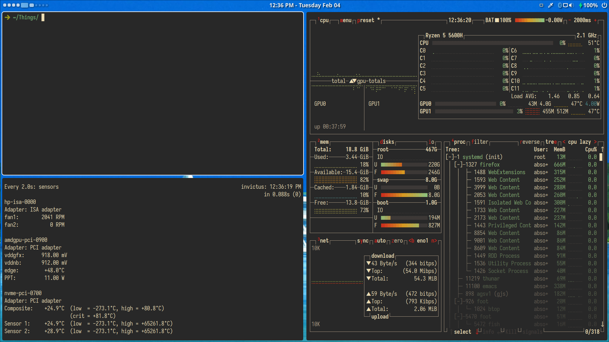

## Sources

1. Slightly modified [AGS](https://github.com/Aylur/ags/tree/v1) Bar from [Aylur](https://github.com/Aylur/dotfiles/tree/pre-astal)
2. Slightly modified Modular Neovim kick-starter config from [here](https://github.com/dam9000/kickstart-modular.nvim)
3. [Doom Emacs](https://github.com/doomemacs/doomemacs)

## Requirements

```
hyprland
hyprlock
agsv1
tofi
brightnessctl
foot
ttf-iosevka-nerd
grim
slurp
wl-clipboard
btop-gpu-git
clipse
```

## Things

```
Iosevka Nerd Font
Gruvbox colors
```

## Screenshots





